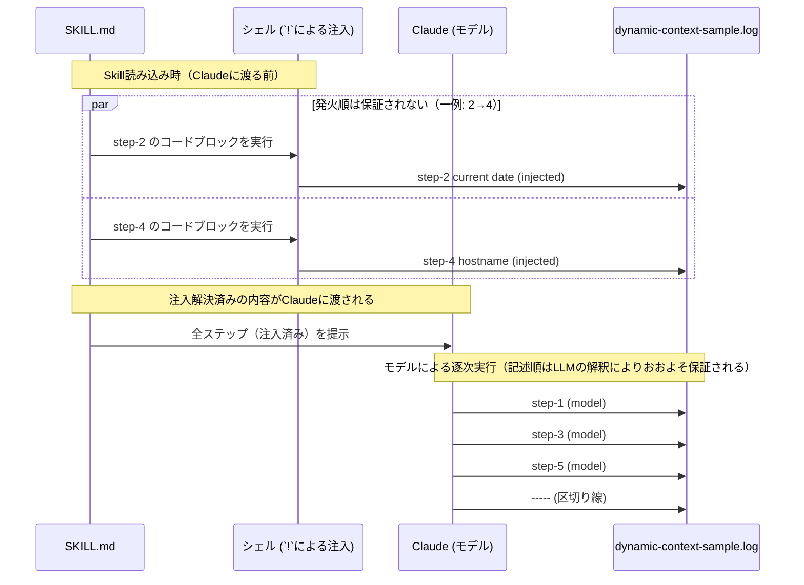

# biopackathon-claude-skills

[biopackathon2026#8](https://sites.google.com/view/biopackathon/biopackathon20268?authuser=0)
「スクリプトに落とせない反復作業を Claude に覚えさせる 〜 Skills 入門 〜」
に関するサンプルレポジトリ。

## セットアップ

```
uv sync
```

## ドキュメント生成 (sphinx-build)

`src/biopackathon_claude_skills/calc.py` の `docstring` (Google スタイル) から、
`sphinx.ext.napoleon` を使ってドキュメントを生成する。

```
uv run sphinx-build -b html docs docs/_build
```

## プレビュー (sphinx-autobuild)

```
uv run sphinx-autobuild docs docs/_build
```

## Skills

`.claude/skills/`配下に、3つのSkillsが含まれている。

### update-docstring

Pythonの関数・メソッド・クラスの`docstring`を、実際の実装（シグネチャ・型ヒント・デフォルト値・送出しうる例外）と同期させ、Googleスタイル（`sphinx.ext.napoleon`互換）に書き換える。`docstring`が欠けている・古い・実装とずれている場合や、関数のシグネチャを変更した直後に使う。モデルが自動的に呼び出す。

### argument-sample

Skillの引数機能（`$ARGUMENTS`、`$ARGUMENTS[N]` / `$N`、フロントマターの`arguments`で宣言する名前付き引数）のデモ。`/argument-sample [first] [second]`のようにスラッシュコマンドとして手動で呼び出す。

### dynamic-context-sample

静的なテキスト出力と、実行時に動的注入される値（日時・ホスト名）の出力を組み合わせたデモ。`/dynamic-context-sample`として手動で呼び出し、実行ごとの内容は`.tmp/dynamic-context-sample.log`に区切り線付きで記録される。

このSkillsは、スライド資料にある通り、単なるデモにとどまらず「動的コンテキストの注入」（インラインの`` !`<command>` ``、コードブロックの`` ```!<command>``` ``構文）が*いつ*実行されるかという挙動の特性を確認する実験の役割も兼ねている。

`SKILL.md`上でのステップ番号（記述順）は1〜6だが、`.tmp/dynamic-context-sample.log`に実際に書き込まれる順序はこれと一致しない。以下はその実行例の1つである。

```
step-2 current date (injected): 2026-08-31 16:00:44.589651567
step-4 hostname (injected): nixos
step-1 (model): This step is sample text output 1
step-3 (model): This step is sample text output 2
step-5 (model): Hello World!
-----
```

これは、`!`による動的コンテキストの注入が、SKILL.mdの内容がClaudeに渡される**前**（Skills読み込み時）に一括して解決されるのに対し、注入を伴わない通常のステップはClaudeが内容を読み込んだ**後**に、モデル自身がツール呼び出しとして実行するためである。

ただし、保証されているのは「注入系のステップ（2, 4）はモデル系のステップ（1, 3, 5）より必ず先に解決される」という点までである。

- **注入系のステップ同士**（step-2とstep-4）は、コードブロックの記述順（2→4）で発火することまでは保証されていない。上記のログ例は`2→4`の順になった一例に過ぎず、実行のたびに`4→2`の順になる可能性もある。
- **モデル系のステップ同士**（step-1, step-3, step-5）は、Skillの機構による保証ではなく、ClaudeがSKILL.mdを読んで記述順に実行する、LLMの解釈によるものである。そのため記述順（1→3→5）はおおよそ保証される、という程度のものである。



つまり仕組みとして保証されるのは「注入系ステップ全体 → モデル系ステップ全体」という2段階の順序関係のみである。記述順（1→2→3→4→5→6）と実行順（2→4→1→3→5→6）が食い違うこと自体は「動的コンテキストの注入は静的な前処理としてSkill読み込み時に完了する」という仕様上の特性を反映したものだが、それ以外の部分——注入系ステップ同士の順序（2→4）、およびモデル系ステップ同士の順序（1→3→5）——は仕組みによる保証ではない。前者は発火順が保証されない一実行例であり、後者はClaudeがSKILL.mdを記述順に解釈することでおおよそ保証される。

## スライド

スライドは、`slides/main/.main.pdf`に存在している。

詳細は、[slides/README.md](./slides/README.md)を参照のこと。

